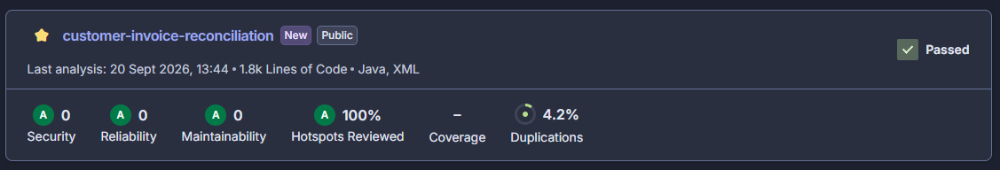

# Decisioni di progetto

Il criterio generale seguito è stato:

> correggere automaticamente solo ciò che può essere interpretato senza ambiguità, mantenere visibili le anomalie e non bloccare l'intero batch per un problema relativo a un singolo record.

## 1. Flusso di elaborazione

Ho suddiviso il processo nelle seguenti fasi:

`caricamento → normalizzazione → associazione → VIES → conversione → riconciliazione → report`

Ho preferito mantenere separate queste responsabilità per rendere esplicito dove viene presa ogni decisione e per evitare che parsing, regole di dominio e produzione dell'output fossero concentrati nella stessa classe.

Non ho introdotto framework applicativi, database o altre infrastrutture non necessarie per un tool batch di queste dimensioni.

## 2. Parsing e conservazione dei dati originali

### CSV

Inizialmente avevo considerato un parsing minimale tramite `String.split(",")`.

Il dataset contiene però valori che possono includere virgole all'interno di campi CSV, ad esempio importi nel formato `1.234,56`.

Ho quindi utilizzato Apache Commons CSV per evitare di implementare manualmente un parser non affidabile.

Il parser non effettua correzioni sui valori: la loro interpretazione viene demandata alla normalizzazione.

### Importi

L'importo della fattura viene inizialmente mantenuto come `String`.

La scelta permette di non perdere il formato originale prima di stabilire se il valore sia interpretabile.

La conversione a `BigDecimal` viene effettuata successivamente, durante la normalizzazione o il calcolo.

Per gli importi monetari ho scelto `BigDecimal` invece di `double` per evitare problemi di precisione.

## 3. Normalizzazione

Ho distinto tre stati:

* `VALIDO`: il dato è già utilizzabile;
* `NORMALIZZATO`: il dato è stato corretto senza ambiguità;
* `ERRORE`: il dato manca oppure non può essere interpretato in modo affidabile.

Uno stato `ERRORE` non rende automaticamente inutilizzabile il record in tutte le fasi successive. Ogni fase verifica quali dati siano effettivamente necessari.

I problemi rilevati durante la normalizzazione vengono mantenuti nei relativi risultati e successivamente propagati nella riconciliazione finale, così che il report possa mostrare anche anomalie che non impediscono l'elaborazione economica.

### Ragioni sociali

Nei due file lo stesso cliente può essere scritto in modi leggermente differenti.

Normalizzo quindi:

* spazi iniziali e finali;
* sequenze di spazi multipli;
* alcune forme societarie note, ad esempio `S.r.l.` → `SRL` e `S.p.A.` → `SPA`.

La stessa funzione viene utilizzata sia per l'anagrafica sia per i nomi presenti sulle fatture.

Non applico trasformazioni più aggressive perché potrebbero rendere uguali società realmente differenti.

### Paesi

I valori presenti nel dataset possono essere espressi come nome del Paese o come codice.

Ho utilizzato una mappatura esplicita verso codici ISO a due lettere per i valori necessari al dataset.

Non ho implementato un sistema generale per tutti i Paesi del mondo: con più tempo utilizzerei una libreria o una tabella ISO completa.

La mappatura corrente rimane quindi intenzionalmente limitata e valori non previsti vengono segnalati anziché interpretati arbitrariamente.

### Partite IVA

Rimuovo spazi e normalizzo il valore in maiuscolo.

Se manca il prefisso internazionale, lo aggiungo solamente quando il Paese è stato determinato in modo affidabile.

Caso concreto: `C008` contiene `12345678903` e Paese Italia. Il valore può quindi essere normalizzato senza ambiguità in `IT12345678903`.

Non implemento invece le regole formali specifiche delle partite IVA di ogni Stato.

Ad esempio `FR123` supera un controllo strutturale minimale, ma viene successivamente indicata dal mock VIES come `INVALID`.

Ho preferito lasciare al servizio dedicato la responsabilità della validazione effettiva.

### Cliente con Paese mancante

`C012` non contiene il Paese, ma possiede già una partita IVA con prefisso `ES`.

Non deduco automaticamente il Paese dalla partita IVA, perché il campo Paese rimane comunque un dato mancante dell'anagrafica.

La partita IVA è però ancora utilizzabile per la verifica VIES e le fatture del cliente possono essere elaborate se dispongono degli altri dati necessari.

L'anomalia relativa al Paese rimane comunque presente nel report finale.

### Tasso USD contrattuale

Un tasso contrattuale presente deve essere maggiore di zero.

L'assenza del valore significa invece che il cliente non dispone di un cambio USD concordato.

Non ho introdotto soglie arbitrarie per decidere se un tasso positivo sia "realistico", perché la consegna non fornisce una regola affidabile per farlo.

## 4. Associazione fatture-clienti

Questa è stata una delle principali ambiguità del progetto.

Ho scelto la seguente precedenza:

1. `cliente_id`;
2. nome normalizzato come fallback;
3. nessuna associazione automatica se il nome non identifica un solo cliente.

### ID valido

Quando `cliente_id` identifica un cliente esistente, considero l'ID la fonte più affidabile.

Il nome non viene utilizzato per sostituire questa associazione.

Ad esempio `F0010` può avere un nome normalizzato che coincide con più record Rossi, ma contiene un ID valido: viene quindi associata tramite ID.

Con più tempo aggiungerei eventualmente un warning quando ID e nome indicano informazioni incoerenti, mantenendo comunque l'ID come riferimento principale.

### ID mancante

`F0007` non contiene `cliente_id`, ma il nome identifica in modo univoco `C002`.

La fattura viene quindi associata tramite nome, mantenendo però l'anomalia relativa all'ID mancante.

### ID inesistente

`F0008` contiene `C999`, che non esiste nell'anagrafica.

Il nome identifica comunque in modo univoco `C002`.

Anche in questo caso effettuo il fallback tramite nome ma mantengo nel risultato il problema relativo all'ID errato.

### Cliente sconosciuto

`F0009` contiene un ID inesistente e un nome che non identifica nessun cliente.

Non provo a utilizzare importo, data o altri indizi per inventare un'associazione.

La fattura rimane quindi non associata e `processabile=false`.

L'importo e la valuta sono però dati indipendenti dall'associazione cliente. Poiché la fattura è già espressa in EUR, l'importo EUR può essere determinato senza ambiguità:

`400 EUR → 400 EUR`, con tasso `1`.

Il valore viene quindi riportato nel report, ma non contribuisce al totale riconciliato perché la fattura non è stata associata in modo affidabile a un cliente.

### Clienti apparentemente duplicati

`C001` e `C004` hanno dati molto simili e, dopo la normalizzazione, possono avere la stessa ragione sociale.

Non li unifico automaticamente perché possiedono identificativi distinti e non esiste una regola affidabile che autorizzi la deduplicazione.

Di conseguenza, se un nome identifica più clienti, il fallback tramite nome non viene accettato.

Ho preferito un'associazione mancata a un falso positivo.

## 5. Fatture apparentemente duplicate

`F0001` e `F0027` hanno dati sostanzialmente identici ma ID fattura differenti.

Non le considero automaticamente duplicate.

Due documenti possono avere stesso cliente, stessa data e stesso importo senza essere necessariamente lo stesso documento.

Senza una regola esplicita o un identificativo comune affidabile, entrambe rimangono nel report.

## 6. Importi anomali

### Formati diversi

Sono accettati e normalizzati formati come:

* `1234.56`
* `1234,56`
* `1.234,56`

`F0023`, ad esempio, contiene `1234,56` e viene convertita in un valore numerico utilizzabile.

### Importo negativo

`F0017` contiene `-500 EUR`.

Non considero automaticamente errato un importo negativo perché può rappresentare una nota di credito, uno storno o una rettifica.

In assenza di una regola contraria nella consegna, viene quindi considerato processabile e contribuisce al totale con valore negativo.

### Importo mancante

`F0024` non contiene l'importo.

Non esiste una trasformazione affidabile possibile, quindi la fattura rimane nel report ma viene marcata come non processabile.

### Valuta mancante

`F0025` contiene l'importo ma non la valuta.

Non assumo automaticamente EUR o un'altra valuta.

L'importo originale viene comunque conservato nel report, mentre l'importo EUR rimane non disponibile.

La fattura non entra nei totali riconciliati.

## 7. Verifica VIES

Il file `vies_mock.json` viene trattato come il servizio VIES richiesto dalla consegna.

Ho distinto esplicitamente:

* `VALID`
* `INVALID`
* `ERROR`
* `NON_SUPPORTATO`
* `NON_VERIFICATA`
* `MANCANTE`

Questa distinzione evita di considerare automaticamente invalida qualsiasi partita IVA che non produca una risposta positiva.

In particolare:

* `INVALID` significa risposta esplicitamente negativa;
* `ERROR` rappresenta un errore del servizio;
* `NON_SUPPORTATO` significa che il servizio non può verificare il caso;
* `NON_VERIFICATA` indica una partita IVA presente ma assente dalle risposte del mock;
* `MANCANTE` indica una partita IVA non disponibile nell'anagrafica.

### Verifica di tutti i clienti

La consegna richiede di validare la partita IVA di ciascun cliente.

La verifica VIES viene quindi effettuata su tutti i clienti presenti nell'anagrafica normalizzata, indipendentemente dal fatto che abbiano o meno fatture associate.

Ogni cliente viene verificato una sola volta, perché la partita IVA appartiene al cliente e non alla singola fattura.

Questo comprende anche clienti come `C004`, che non risultano associati ad alcuna fattura ma fanno comunque parte dell'anagrafica fornita.

Il riepilogo VIES finale è quindi riferito ai clienti dell'anagrafica e non al numero di fatture.

### Esito VIES e processabilità della fattura

Ho scelto di non far dipendere automaticamente la processabilità economica dall'esito VIES.

Un esito negativo o non disponibile rappresenta un'anomalia amministrativa o fiscale da evidenziare nel report, ma non impedisce necessariamente di determinare in modo affidabile il cliente, l'importo e il relativo valore in EUR.

Ad esempio una fattura può quindi essere economicamente processabile anche se il VIES restituisce:

* `INVALID`;
* `ERROR`;
* `NON_SUPPORTATO`;
* `MANCANTE`.

L'anomalia rimane comunque chiaramente visibile nel risultato finale.

### IVA mancante ma fattura processabile

`C007` non possiede partita IVA e quindi produce `MANCANTE`.

Le sue fatture possono comunque essere riconciliate economicamente.

Ho quindi separato volutamente:

* anomalia amministrativa/fiscale;
* possibilità di calcolare correttamente l'importo della fattura.

## 8. Conversione delle valute

### EUR

Gli importi già in EUR non richiedono una conversione valutaria.

L'importo EUR coincide con quello originale e il tasso viene rappresentato come `1`.

Questa informazione può essere determinata anche quando una fattura non è associabile a un cliente. In quel caso l'importo EUR viene comunque riportato, ma la fattura rimane non processabile ai fini della riconciliazione.

### USD con tasso contrattuale

La consegna specifica che il cambio concordato deve essere utilizzato per tutte le fatture USD del cliente indipendentemente dalla data.

Il tasso contrattuale ha quindi precedenza sul cambio storico.

Esempi presenti nei dati:

* `C007`: tasso `0.92`;
* `C014`: tasso `0.95`.

Il contratto riguarda soltanto USD: una fattura EUR dello stesso cliente non utilizza tale tasso.

### Altre valute

Negli altri casi utilizzo Frankfurter richiedendo il cambio verso EUR relativo alla data di emissione e il provider ECB.

Conservo anche il tasso utilizzato nel risultato per rendere verificabile la conversione.

Gli importi EUR vengono arrotondati a due decimali utilizzando `RoundingMode.HALF_UP`.

### Valuta formalmente valida ma non disponibile

`F0016` contiene `AED`.

Il codice valuta è formalmente composto da tre lettere, quindi non viene scartato durante la normalizzazione.

La disponibilità effettiva del cambio viene verificata nella fase dedicata.

Durante l'esecuzione Frankfurter restituisce un errore HTTP per questo caso.

La singola fattura viene quindi considerata non processabile, ma l'errore non interrompe il resto del batch.

Non utilizzo un tasso inventato o relativo a un'altra valuta.

### Giorni senza fixing BCE

Nel dataset è presente anche una fattura in una data festiva (`F0026`, 25 dicembre).

La versione corrente utilizza il valore restituito da Frankfurter per la data richiesta e non implementa una politica propria per weekend o festività.

Con più tempo verificherei esplicitamente il comportamento desiderato quando la BCE non pubblica un fixing nel giorno della fattura, decidendo insieme al dominio se utilizzare l'ultimo giorno disponibile o considerare il caso non processabile.

## 9. Significato di "processabile"

Ho interpretato `processabile` come:

> possibilità di completare in modo affidabile la riconciliazione economica della fattura nel suo complesso.

Non significa quindi che il record sia privo di qualunque anomalia.

Una fattura può essere processabile pur avendo, ad esempio:

* ID cliente originariamente mancante ma associazione tramite nome univoco;
* partita IVA `INVALID`;
* errore VIES;
* Paese non supportato da VIES;
* partita IVA mancante;
* altre anomalie di normalizzazione che non impediscono il calcolo economico.

Una fattura non è invece processabile quando manca un elemento indispensabile alla riconciliazione, ad esempio:

* cliente non associabile;
* importo mancante;
* valuta mancante;
* cambio necessario non disponibile.

`processabile=false` non implica che nessuna informazione possa essere calcolata.

Ad esempio `F0009` non è riconciliabile perché manca un cliente affidabile, ma essendo già espressa in EUR è comunque possibile riportare correttamente il suo importo EUR.

Questa separazione permette di conservare tutte le informazioni affidabili disponibili senza considerare riconciliato un record che presenta problemi bloccanti.

## 10. Gestione degli errori

Il principio adottato è:

> un errore relativo a una fattura non deve impedire l'elaborazione delle altre.

I problemi rilevati durante:

* normalizzazione della fattura;
* normalizzazione del cliente;
* associazione;
* verifica VIES;
* conversione valutaria;

vengono aggregati nel risultato finale.

Per evitare che lo stesso problema venga mostrato più volte, i messaggi vengono raccolti mantenendo l'ordine ma eliminando eventuali duplicati.

I record non processabili rimangono nel report invece di essere scartati silenziosamente, così che l'amministrazione possa individuare quelli che richiedono intervento manuale.

Quando possibile, vengono mantenute anche le informazioni determinabili con certezza, anche quando il record nel suo complesso non è processabile.

## 11. Report finale

Ho scelto JSON come formato principale perché è:

* strutturato;
* leggibile;
* facilmente elaborabile da altri sistemi;
* adatto a contenere contemporaneamente risultati e anomalie.

Il JSON non serializza direttamente l'intero modello interno.

`RisultatoReportJson` contiene solamente i dati utili per il report amministrativo, evitando di legare il formato esterno alla struttura completa delle classi applicative.

Per ogni fattura vengono riportati, quando disponibili:

* ID fattura;
* cliente associato;
* partita IVA;
* metodo di associazione;
* esito VIES;
* importo e valuta originali;
* importo EUR;
* tasso utilizzato;
* stato di processabilità;
* problemi rilevati.

Il report conserva le informazioni determinabili anche nei record non processabili.

Ad esempio `F0009` riporta `400 EUR` come importo originale e `400 EUR` come importo EUR, con tasso `1`, ma rimane `processabile=false` perché non è stato possibile determinare un cliente affidabile.

Il report contiene inoltre riepiloghi relativi a:

* fatture processabili e non processabili;
* totale EUR;
* modalità di associazione;
* esiti VIES.

Il totale EUR viene calcolato esclusivamente sulle fatture considerate processabili.

Di conseguenza, i `400 EUR` di `F0009` non vengono inclusi nel totale riconciliato.

## 12. Riesecuzione del job

La consegna richiede che il job possa essere rieseguito senza duplicare o corrompere il risultato precedente.

Ho interpretato questo requisito come idempotenza dell'output.

Il file:

`output/report.json`

viene completamente sovrascritto a ogni esecuzione.

Non viene effettuato append dei nuovi risultati al file precedente. Di conseguenza, eseguendo più volte il job sugli stessi dati, il report continua a contenere lo stesso insieme di risultati anziché accumulare quelli delle esecuzioni precedenti.

La riesecuzione del job e la deduplicazione dei dati di input sono però due aspetti distinti: eventuali record apparentemente duplicati già presenti nei CSV vengono mantenuti quando non esiste una regola affidabile che permetta di considerarli lo stesso record.

Ad esempio, `F0001` e `F0027` rimangono entrambe nel report perché hanno identificativi differenti, anche se altri dati risultano uguali.

## 13. Esecuzione riproducibile con Docker

Per evitare che l'esecuzione dipenda dalla versione di Java o Maven installata sulla macchina del valutatore, ho aggiunto una configurazione Docker.

L'immagine viene costruita in due fasi:

1. Maven compila il progetto ed esegue la suite di test;
2. l'immagine finale contiene solamente il runtime Java, le classi compilate, le dipendenze e i dati necessari all'esecuzione.

In questo modo sulla macchina che esegue il progetto non è necessario installare Java, Maven o un IDE.

Sono sufficienti Docker con Docker Compose e una connessione Internet, necessaria per recuperare i tassi di cambio tramite Frankfurter.

Docker non fa parte della logica applicativa: viene utilizzato esclusivamente per rendere il processo di build ed esecuzione riproducibile.

## 14. Cosa ho volutamente lasciato fuori

Ho evitato di trasformare il progetto in un sistema più complesso del necessario.

### Validazione IVA specifica per Paese

Non ho implementato manualmente algoritmi fiscali nazionali.

Con più tempo utilizzerei una libreria o una fonte affidabile per effettuare una validazione strutturale specifica prima della verifica VIES.

### Gestione completa dei Paesi

La mappatura attuale è limitata ai valori affrontati nel progetto.

In un'applicazione reale utilizzerei una sorgente ISO completa e gestirei esplicitamente tutte le varianti ammesse.

### Associazione approssimativa dei nomi

Non ho implementato un'associazione automatica basata sulla semplice somiglianza tra nomi.

Un nome simile potrebbe infatti appartenere a un cliente diverso. Ho quindi preferito associare una fattura tramite nome solo quando, dopo la normalizzazione, esiste una sola corrispondenza certa nell'anagrafica.

### Deduplicazione

Non ho implementato deduplicazione automatica di clienti o fatture sulla base di campi simili.

Preferisco conservare due record distinti piuttosto che eliminarne uno senza una regola di dominio affidabile.

### Parsing di alcuni valori completamente malformati

Gli importi vengono mantenuti come stringa fino alla normalizzazione, ma la stessa strategia non è stata applicata a tutti i campi.

In particolare:

* una data presente ma completamente non interpretabile;
* un tasso USD contrattuale presente ma non numerico;

possono ancora fallire durante il caricamento.

Con più tempo manterrei anche questi valori in forma raw e sposterei completamente la loro interpretazione nella fase di normalizzazione, così da trasformare ogni errore in un problema della singola riga invece di rischiare di interrompere il caricamento.

### Identificativi duplicati nell'anagrafica

L'anagrafica clienti viene indicizzata tramite ID.

La soluzione corrente assume quindi che `id_cliente` sia unico.

Con più tempo aggiungerei un controllo esplicito per intercettare eventuali ID duplicati anziché affidarmi implicitamente all'unicità del dato.

### Struttura delle righe CSV

Il parser gestisce correttamente il formato CSV, ma il caricamento presume che le righe contengano le colonne previste dalla consegna.

In una versione più robusta aggiungerei controlli espliciti anche su righe incomplete o con struttura inattesa, così da trasformarle in anomalie del singolo record.

### Collegamento tra le fasi

La pipeline viene eseguita interamente in memoria e le varie fasi lavorano sulle stesse istanze di `Cliente` e `Fattura`.

Per questo motivo alcuni risultati vengono collegati tramite identità dell'oggetto.

Questa soluzione è semplice e adeguata all'architettura attuale, ma non sarebbe adatta se in futuro gli oggetti venissero serializzati, ricreati o caricati da un database.

In quel caso utilizzerei identificativi tecnici stabili per collegare i risultati delle varie fasi.

### Note libere

Le informazioni presenti nel campo `note` non vengono utilizzate dalla logica del programma.

Ho scelto di non interpretare automaticamente testo libero per influenzare associazioni, validazioni o altre regole di elaborazione.

Con più tempo valuterei se trasformare le informazioni rilevanti presenti nelle note in campi strutturati e gestibili in modo affidabile.

## 15. Miglioramenti che farei con più tempo

Oltre ai miglioramenti già indicati nelle sezioni precedenti, con più tempo:

amplierei la copertura dei test, includendo un numero maggiore di casi limite e combinazioni di anomalie;
renderei ancora più robusta la gestione dei controlli e degli errori, soprattutto nelle fasi di caricamento e interpretazione dei dati.

## 16. Esecuzione riproducibile con Docker

Ho scelto di configurare il progetto per l'esecuzione tramite Docker, così da evitare dipendenze dalla versione di Java o Maven installata sulla macchina del valutatore.

La build Docker compila il progetto ed esegue automaticamente i test, mentre l'immagine finale contiene tutto ciò che serve per avviare il tool.

In questo modo, per eseguire il progetto sono sufficienti Docker con Docker Compose e una connessione Internet, necessaria per recuperare i tassi di cambio tramite Frankfurter.

Ho verificato l'esecuzione completa del progetto tramite Docker utilizzando i dati forniti, compresa la generazione del file `output/report.json`.

## 17. Verifiche finali

La suite automatica comprende:

* **17 test**
* **0 failure**
* **0 errori**
* **0 test saltati**

Sono presenti test specifici anche per:

* la validazione VIES di un cliente senza fatture associate;
* il mantenimento dell'importo EUR di una fattura già espressa in EUR ma non associabile a un cliente.

Sull'intero dataset fornito il risultato finale è:

* **28 fatture totali**
* **24 processabili**
* **4 non processabili**
* **25 associazioni tramite ID**
* **2 associazioni tramite nome**
* **1 fattura non associata**
* **totale riconciliato: 37.475,60 EUR**

Il riepilogo VIES sui 14 clienti dell'anagrafica è:

* `VALID`: **8**
* `INVALID`: **2**
* `ERROR`: **2**
* `NON_SUPPORTATO`: **1**
* `NON_VERIFICATA`: **0**
* `MANCANTE`: **1**

### Analisi statica

È stata inoltre eseguita un'analisi statica tramite SonarQube Cloud. Il progetto ha superato il Quality Gate, con 0 issue relative a Security, Reliability e Maintainability e il 100% dei Security Hotspots revisionati.

